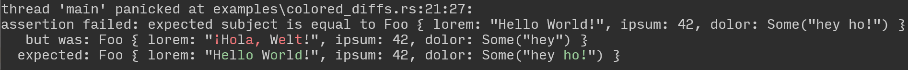

# Asserting

[![crates.io][crates-badge]][crates-url]
[![docs.rs][docs-badge]][docs-url]
![MSRV][msrv-badge]
[![code coverage][code-coverage-badge]][code-coverage-url]

Fluent assertions for tests in Rust that are convenient to write and easy to extend.

The goals for `asserting` are:

1. assertions are convenient to write and easy to read
2. helpful error messages in case of failing assertions
3. colored diffs between expected and actual values
4. provide a sensible number of assertions out of the box
5. do not require that asserted types have to implement traits if it is not absolutely necessary
6. support for asserting custom types with provided assertions
7. writing custom assertions requires minimal effort
8. support no-std environments

### Convenient to write

The expected value does not need to be exactly of the same type as the subject. For example, instead
of writing:

```rust
#[test]
fn the_message_is_right() {
    let message = "lorem consectetur ipsum exercitation".to_string();

    assert_that!(message).is_equal_to("lorem consectetur ipsum exercitation".to_string());
}
```

with `asserting` we can write:

```rust
#[test]
fn the_message_is_right() {
    let message = "lorem consectetur ipsum exercitation".to_string();

    assert_that!(message).is_equal_to("lorem consectetur ipsum exercitation");
}
```

Note that we do not convert the expected value to a `String`.

This might seem to be a minor advantage, but when writing assertions for a collection of `String`s,
converting every expected `&str` to `String` results in lots of noise.

### Easy to extend

Easy-to-extend means that we can write assertions for custom types with minimal effort.

`asserting` provides three kinds of custom assertions:

1. use any predicate function as a custom assertion (see "[predicate as custom assertion]")
2. property-based assertions can be used with any type that implements the related property
   (see "[property-based assertions]")
3. write custom assertions by implementing two simple traits (see "[custom assertions]")

The mentioned references link to a chapter in the crate's documentation that describes the
possibilities for custom assertions including examples.

## no-std support

To use `asserting` in a no-std environment disable the default features. Features that do not
require std can still be added.

```toml
[dev-dependencies]
asserting = { version = "0.4", default-features = false, features = ["colored", "float_cmp"] }
```

An allocator is still needed for no-std.

## Highlighted differences

`asserting` can highlight the differences between the expected value(s) and the actual value(s) when
printing assertion failures to the terminal. The colored diffs in assertion failures look like this:



It supports different variants of how differences are highlighted.

| Mode       | Effect                                                                                                                            |
|------------|-----------------------------------------------------------------------------------------------------------------------------------|
| bold       | Differences are printed in bold letters, without coloring.                                                                        | 
| red-green  | Differences are printed in the colors <span style="color: green">green</span> and <span style="color: red">red</span>.            | 
| red-blue   | Differences are printed in the CVD-friendly colors <span style="color: blue">blue</span> and <span style="color: red">red</span>. | 
| red-yellow | Differences are printed in the colors <span style="color: yellow">yellow</span> and <span style="color: red">red</span>.          | 
| off        | Switches off highlighting. The differences are not highlighted at all.                                                            | 

The mode can be configured by setting the environment variable `ASSERTING_HIGHLIGHT_DIFFS` to one
of the modes in the table above. The value is case-insensitive. E.g., setting the environment
variable to values like `Red-Blue`, `Bold` or `OFF` works as well.

The intended way for configuring the highlighting mode is to set the environment variable in the
configuration for `Cargo` by adding it to the `[env]` section in your `~/.cargo/config.toml` file:

```toml,no_sync
[env]
ASSERTING_HIGHLIGHT_DIFFS = "red-blue"
```

By default, the mode `red-green` is used. Differences are colored in
<span style="color: green">green</span> and <span style="color: red">red</span>.

Differences are only highlighted if the crate feature `colored` is enabled. The configuration via
the environment variable only works when the crate feature `std` is enabled too. In no-std projects,
the default colors red and green are used.

*Asserting* respects the [`NO_COLOR`] environment variable. If the `NO_COLOR` environment variable
is set no colors are used regardless of the configured highlight mode.

## Available Assertions

This chapter gives an overview for the assertions provided by `asserting`. For a comprehensive list
of available assertions including examples browse the documentation of the [`assertions`] module.
The documentation of the assertion traits contains examples on how to use each assertion. The
[crate level documentation][docs-url] contains lots of examples as a quick introduction.

### Equality

for all types that implement `PartialEq<E>` with `E` being the type of the expected value.

| assertion       | description                                              |
|-----------------|----------------------------------------------------------|
| is_equal_to     | verify that the subject is equal to an expected value    |
| is_not_equal_to | verify that the subject is not equal to a specific value |                                                 

### Order

for all types that implement `PartialOrd<E>` with `E` being the type of the expected value.

| assertion       | description                                                                            |
|-----------------|----------------------------------------------------------------------------------------|
| is_greater_than | verify that the subject is greater than the expected value                             |                                                 
| is_less_than    | verify that the subject is less than the expected value                                |
| is_at_least     | verify that the subject is greater than or equal to the expected value                 |                                                 
| is_at_most      | verify that the subject is less than or equal to the expected value                    |
| is_before       | verify that the subject is less than (before) the expected value                       |
| is_after        | verify that the subject is greater than (after) the expected value                     |
| is_between      | verify that the subject is between a min value (inclusive) and a max value (inclusive) |

### Range

for all types `T` that implement `PartialOrd<E>` and `E` implementing `PartialOrd<T>` with `E`
being the type of the expected value.

| assertion       | description                                           |
|-----------------|-------------------------------------------------------|
| is_in_range     | verify that the subject is in the expected range      |                                                 
| is_not_in_range | verify that the subject is not in the specified range |

### Integer and Float

for integer numbers of type `i8`, `i16`, `i32`, `i64`, `i128` and `isize` as well as <br/>
floating point numbers of type `f32` and `f64`:

| assertion       | description                                          |
|-----------------|------------------------------------------------------|
| is_negative     | verify that the subject is a negative number         |
| is_not_negative | verify that the subject is a positive number or zero |
| is_positive     | verify that the subject is a positive number         |
| is_not_positive | verify that the subject is a finite number           |                                                 

for integer numbers of type `i8`, `i16`, `i32`, `i64`, `i128`, `isize`, `u8`, `u16`, `u32`, `u64`,
`u128` and `usize` as well as <br/>
floating point numbers of type `f32` and `f64`:

| assertion | description                                                  |
|-----------|--------------------------------------------------------------|
| is_zero   | verify that the subject is the additive identity (zero)      |                                                 
| is_one    | verify that the subject is the multiplicative identity (one) |                                                 

for floating point numbers of type `f32` and `f64`:

| assertion       | description                                   |
|-----------------|-----------------------------------------------|
| is_infinite     | verify that the subject is an infinite number |
| is_finite       | verify that the subject is a finite number    |                                                 
| is_not_a_number | verify that the subject is not a number       |
| is_a_number     | verify that the subject is a number           |

### Float comparison

for floating point numbers of type `f32` and `f64`.

requires crate feature `float_cmp` which is enabled by default.

| assertion                   | description                                                                                      |
|-----------------------------|--------------------------------------------------------------------------------------------------|
| is_close_to                 | verify that the subject is approximately equal to the expected value within a default margin     |                                                 
| is_not_close_to             | verify that the subject is not approximately equal to the expected value within a default margin |
| is_close_to_with_margin     | verify that the subject is approximately equal to the expected value within the given margin     |
| is_not_close_to_with_margin | verify that the subject is not approximately equal to the expected value within the given margin |

### Boolean

for `bool`.

| assertion | description                      |
|-----------|----------------------------------|
| is_true   | verify that the subject is true  |                                                 
| is_false  | verify that the subject is false |

### String

for strings of type `String` and `str`:

| assertion                   | description                                                                    |
|-----------------------------|--------------------------------------------------------------------------------|
| is_empty                    | verify that a string is empty                                                  |                                                 
| is_not_empty                | verify that a string is not empty                                              |
| has_length                  | verify that a string has exactly the expected length                           |                                                 
| has_length_in_range         | verify that a string has a length that is in the expected range                |
| has_length_less_than        | verify that a string has a length less than the expected length                |
| has_length_greater_than     | verify that a string has a length greater than the expected length             |
| has_at_most_length          | verify that a string has a length less than or equal to the expected length    |
| has_at_least_length         | verify that a string has a length greater than or equal to the expected length |
| has_char_count              | verify that a string contains exactly the expected number of characters        |                                                 
| has_char_count_in_range     | verify that a string contains a number of characters in the expected range     |
| has_char_count_less_than    | verify that a string contains less than the expected number of characters      |
| has_char_count_greater_than | verify that a string contains more than the expected number of characters      |
| has_at_most_char_count      | verify that a string contains at most the expected number of characters        |
| has_at_least_char_count     | verify that a string contains at least the expected number of characters       |
| contains                    | verify that a string contains the expected substring or character              |
| starts_with                 | verify that a string starts with the expected substring or character           |
| ends_with                   | verify that a string ends with the expected substring or character             |
| contains_any_of             | verify that a string contains any character from a collection of `char`s       |

for strings of type `CString` and `CStr`:

| assertion               | description                                                                    |
|-------------------------|--------------------------------------------------------------------------------|
| is_empty                | verify that a string is empty                                                  |                                                 
| is_not_empty            | verify that a string is not empty                                              |
| has_length              | verify that a string has exactly the expected length                           |                                                 
| has_length_in_range     | verify that a string has a length that is in the expected range                |
| has_length_less_than    | verify that a string has a length less than the expected length                |
| has_length_greater_than | verify that a string has a length greater than the expected length             |
| has_at_most_length      | verify that a string has a length less than or equal to the expected length    |
| has_at_least_length     | verify that a string has a length greater than or equal to the expected length |

for strings of type `OsString` and `OsStr` (requires crate feature `std`):

| assertion               | description                                                                    |
|-------------------------|--------------------------------------------------------------------------------|
| is_empty                | verify that a string is empty                                                  |                                                 
| is_not_empty            | verify that a string is not empty                                              |
| has_length              | verify that a string has exactly the expected length                           |                                                 
| has_length_in_range     | verify that a string has a length that is in the expected range                |
| has_length_less_than    | verify that a string has a length less than the expected length                |
| has_length_greater_than | verify that a string has a length greater than the expected length             |
| has_at_most_length      | verify that a string has a length less than or equal to the expected length    |
| has_at_least_length     | verify that a string has a length greater than or equal to the expected length |

### Option

for the `Option` type.

| assertion | description                                                            |
|-----------|------------------------------------------------------------------------|
| is_some   | verify that an option has some value                                   |                                                 
| is_none   | verify that an option has no value                                     |
| has_value | verify that an option has a value equal to the expected one            |
| some      | verify that an option has some value and map the subject to this value |

### Result

for the `Result` type.

| assertion         | description                                                                                              |
|-------------------|----------------------------------------------------------------------------------------------------------|
| is_ok             | verify that a result has an ok value                                                                     |                                                 
| is_err            | verify that a result has an err value                                                                    |
| has_value         | verify that a result has an ok value that is equal to the expected value                                 |
| has_error         | verify that a result has an err value that is equal to the expected error                                |
| has_error_message | verify that a result has an err value with a string representation that is equal to the expected message |
| ok                | verify that a result has an ok value and map the subject to this ok value                                |
| err               | verify that a result has an err value and map the subject to this err value                              |

### Emptiness

for collections and strings.

| assertion    | description                          |
|--------------|--------------------------------------|
| is_empty     | verify that the subject is empty     |                                                 
| is_not_empty | verify that the subject is not empty |

The implementation of these assertions is based on the property trait [`IsEmptyProperty`].
Implementing this property for any type enables these assertions for that type.

### Length (Size)

for collections and strings.

| assertion               | description                                                                       |
|-------------------------|-----------------------------------------------------------------------------------|
| has_length              | verify that the subject has exactly the expected length                           |                                                 
| has_length_in_range     | verify that the subject has a length that is in the expected range                |
| has_length_less_than    | verify that the subject has a length less than the expected length                |
| has_length_greater_than | verify that the subject has a length greater than the expected length             |
| has_at_most_length      | verify that the subject has a length less than or equal to the expected length    |
| has_at_least_length     | verify that the subject has a length greater than or equal to the expected length |

The implementation of these assertions is based on the property trait [`LengthProperty`].
Implementing this property for any type enables these assertions for that type.

### Iterator / Collection

for all iterators.

| assertion                     | description                                                                                                             |
|-------------------------------|-------------------------------------------------------------------------------------------------------------------------|
| contains                      | verify that an iterator/collection contains an item that is equal to the expected value                                 |                                                
| contains_exactly_in_any_order | verify that an iterator/collection contains exactly the expected values and nothing else in any order                   |
| contains_any_of               | verify that an iterator/collection contains at least one of the given values                                            |
| contains_all_of               | verify that an iterator/collection contains all the expected values in any order (and maybe more)                       |
| contains_only                 | verify that an iterator/collection contains only the given values and nothing else in any order and ignoring duplicates |
| contains_only_once            | verify that an iterator/collection contains only the given values in any order and each of them only once               |

for iterators that yield items in a well-defined order.

All the above assertions provided for any kind of iterator plus the following:

| assertion             | description                                                                                                                                      |
|-----------------------|--------------------------------------------------------------------------------------------------------------------------------------------------|
| contains_exactly      | verify that an iterator/collection contains exactly the expected values and nothing else in the given order                                      |
| contains_sequence     | verify that an iterator/collection contains the given sequence of values in the given order and without extra values between the sequence values |
| contains_all_in_order | verify that an iterator/collection contains all the given values and in the given order, possibly with other values between them                 |
| starts_with           | verify that an iterator/collection contains the given values as the first elements in order                                                      |
| ends_with             | verify that an iterator/collection contains the given values as the last elements in order                                                       |

### Panic

for code inside a closure.

requires the crate feature `panic` which is enabled by default.

| assertion           | description                                            |
|---------------------|--------------------------------------------------------|
| does_not_panic      | verify that some code does not panic                   |                                                
| panics              | verify that some code panics                           |
| panics_with_message | verify that some code panics with the expected message |

To start assertions on code use the `assert_that_code!()` macro.

<!-- Badges and related URLs -->

[crates-badge]: https://img.shields.io/crates/v/asserting.svg

[crates-url]: https://crates.io/crates/asserting

[docs-badge]: https://docs.rs/asserting/badge.svg

[docs-url]: https://docs.rs/asserting

[msrv-badge]: https://img.shields.io/crates/msrv/asserting?color=chocolate

[code-coverage-badge]: https://codecov.io/github/innoave/asserting/graph/badge.svg?token=o0w7R7J0Op

[code-coverage-url]: https://codecov.io/github/innoave/asserting

<!-- External Links -->

[custom assertions]: https://docs.rs/asserting/#custom-assertions

[predicate as custom assertion]: https://docs.rs/asserting/#predicate-as-custom-assertion

[property-based assertions]: https://docs.rs/asserting/#property-based-assertions

[`assertions`]: https://docs.rs/asserting/latest/asserting/assertions/

[`DefinedOrderProperty`]: https://docs.rs/asserting/latest/asserting/properties/trait.DefinedOrderProperty.html

[`IsEmptyProperty`]: https://docs.rs/asserting/latest/asserting/properties/trait.IsEmptyProperty.html

[`LengthProperty`]: https://docs.rs/asserting/latest/asserting/properties/trait.LengthProperty.html

[`NO_COLOR`]: https://no-color.org/
